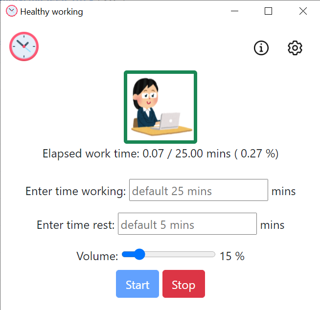
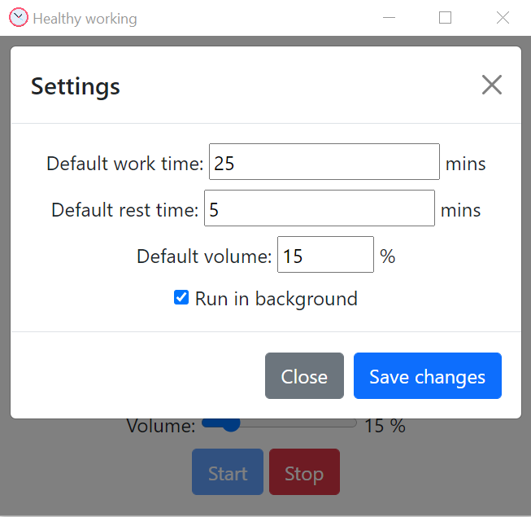

Healthy working for Desktop
================================

Sitting too much is [bad for your health](https://mayocl.in/3p0takQ) and developers often sit too much. I made this desktop app to notify myself to stand up and exercise when I code or study. I hope this app can help others too.

This app uses webcam to detect user sitting. It uses [face-api.js](https://justadudewhohacks.github.io/face-api.js/docs/index.html) for face detection.

There is also a web version of this app. You can try the web app here: https://app-healthyworking.netlify.app/. The source code for the web app can be found [here](https://github.com/student158/healthy_working_web).

<p align="center">
   
</p>

Features
---------

* Run in background mode: The app will minimize to the tray icon.

<p align="center">

</p>

* Set your preference time for sitting and resting.

<p align="center">

</p>

* Toast and sound notification: Toast notification is helpful when you watch Youtube or listening music.

<p align="center">

</p>

<p align="center">

</p>

Run in your machine
----------
Just pull the repo and run the following
```
npm install

npm start
```

Credits
---------
Images and icons used in the app:
<ul>
    <li><a href="https://www.flaticon.com/free-icons/settings" title="settings icons" target="_blank">Settings icons created by Freepik - Flaticon</a></li>
    <li><a href="https://www.flaticon.com/free-icons/clock" title="clock icons" target="_blank">Clock icons created by Freepik - Flaticon</a></li>
    <li><a href="https://www.flaticon.com/free-icons/info" title="info icons" target="_blank">Info icons created by Freepik - Flaticon</a></li>
    <li><a href="https://www.irasutoya.com/2018/11/blog-post_184.html" target="_blank">Exercise illustration</a></li>
    <li><a href="https://www.irasutoya.com/2013/10/blog-post_6464.html" target="_blank">Working illustration</a></li>
</ul>

License
---------

The MIT License (MIT)
