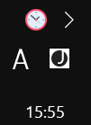
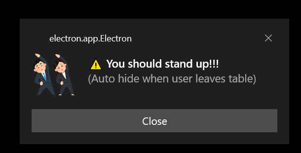
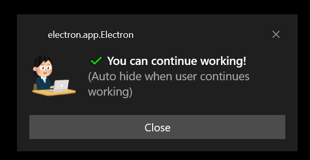

Healthy working for Desktop
================================

Sitting too much is [bad for your health](https://mayocl.in/3p0takQ) and developers often sit too much. I made this app to remind me when I code or study. When I sit for 25 mins (my preference), the app will notify me to stand up and exercise about 5 mins.

Note: This app uses webcam to detect sitting.

Features
---------

* Run in background mode: The app will minimize to the tray icon.

 
* Set your preference time for sitting and resting.

* Toast and sound notification: Toast notification helpful when you watch Youtube or listening music.

License
---------

The MIT License (MIT)
